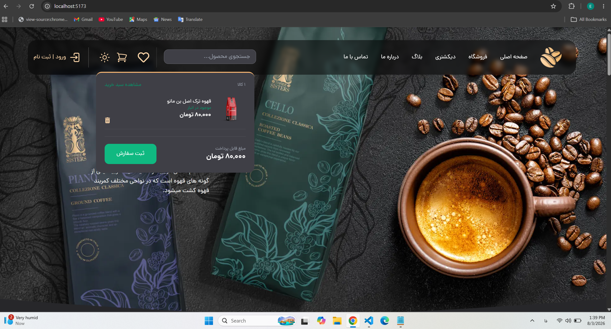
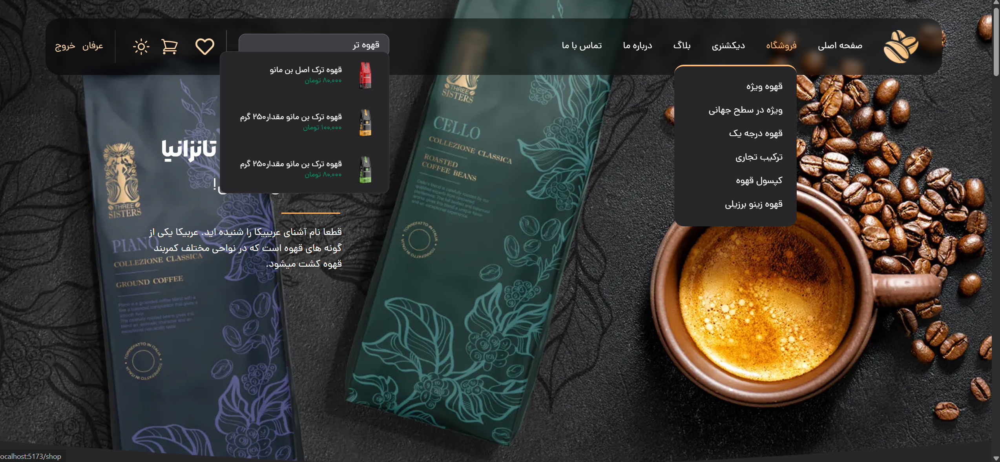
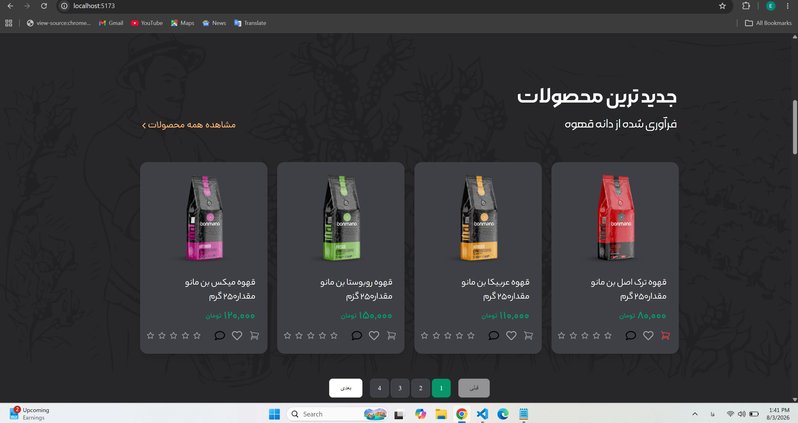
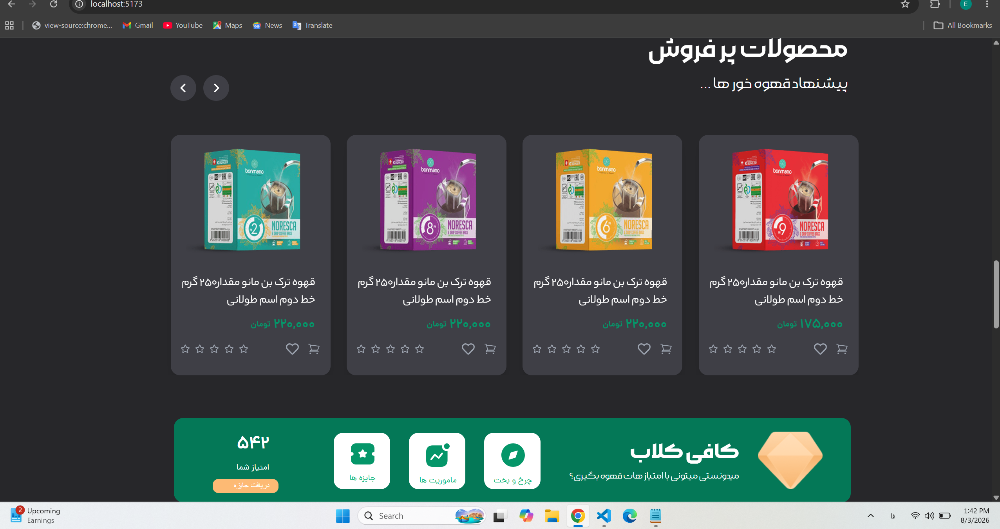
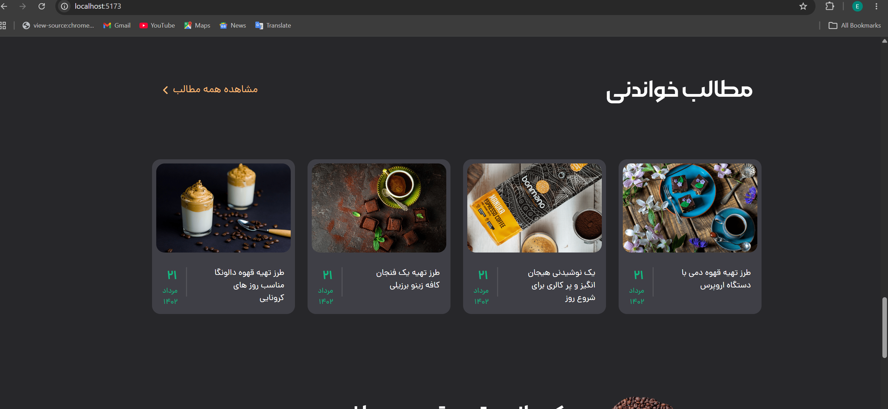
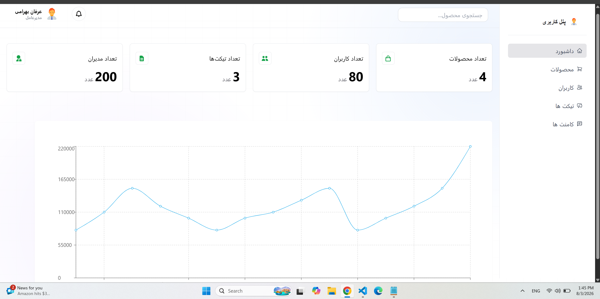
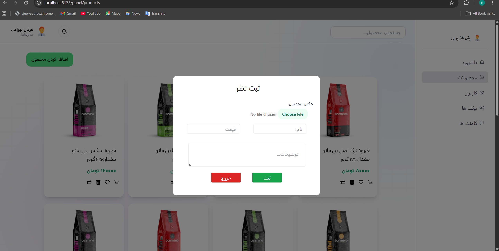
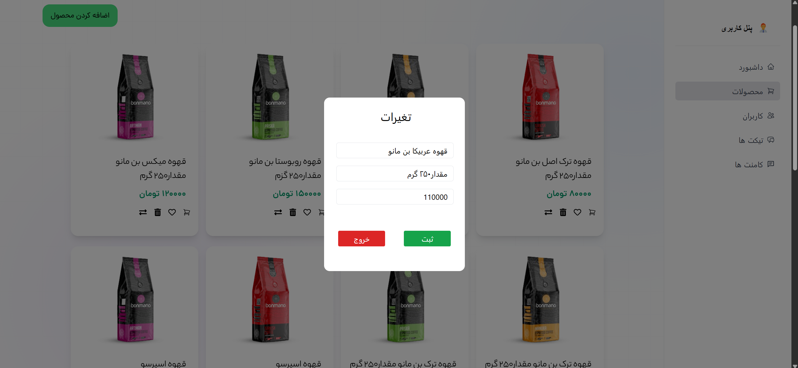
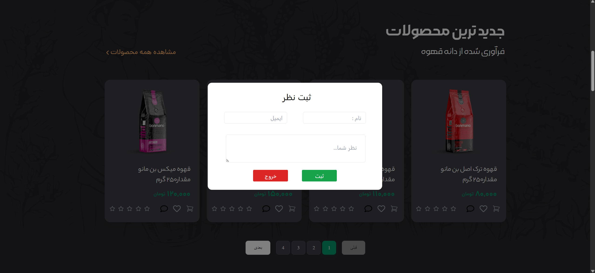
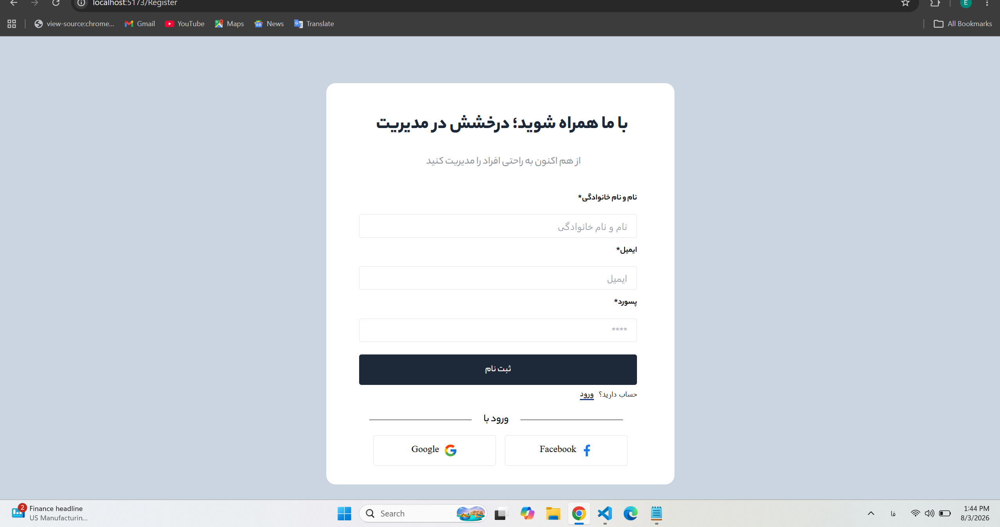

# ☕ Coffee Shop React

A modern Coffee Shop web application built with **React** featuring an online shop, shopping cart, wishlist, authentication, and a complete **Admin Dashboard** for product management.

---

## 📸 Project Preview

### 🏠 Home



---

### Menu



---

### ☕ Products



---


### ⭐ Popular Products



---

### 📚 Blog



---

### 📊 Admin Dashboard



---

### ➕ Add Product



---

### ✏️ Edit Product



---

### 💬 Comments Management



---

### 👤 Register



---

## ✨ Features

- 🛍 Product Listing
- ❤️ Wishlist
- 🛒 Shopping Cart
- 🔍 Product Search
- 🌙 Dark Mode
- 👤 Authentication
- 📦 Product CRUD
- 💬 Comment Management
- 📊 Dashboard Charts
- 📱 Responsive Layout (Desktop & Mobile)
- ⚡ Fast Data Fetching with React Query

---

## 🛠 Tech Stack

### Frontend

- React
- Vite
- Tailwind CSS
- React Router
- Axios
- TanStack React Query
- React Hook Form
- Recharts
- React Icons

### Backend

- JSON Server

---

## 🚀 Installation

Clone the repository

```bash
git clone https://github.com/Erfan-Bahrami/coffee-shop-react.git
```

Install dependencies

```bash
npm install
```

Run React

```bash
npm run dev
```

Run JSON Server

```bash
npm run server
```

---

## 📂 Folder Structure

```text
src
│
├── Api
├── Components
├── Context
├── Data
├── Hooks
├── Layout
├── Login
├── Register
├── Panel
└── Routes
```

---

## 📌 Future Improvements

- Deploy Backend
- Full Responsive Design
- User Profile
- Order History
- Payment Gateway
- Product Categories
- Better Dashboard Analytics

---

## 👨‍💻 Author

**Erfan Bahrami**

GitHub:
https://github.com/Erfan-Bahrami

LinkedIn:
https://www.linkedin.com/in/your-linkedin/

---

⭐ If you like this project, don't forget to Star the repository.
